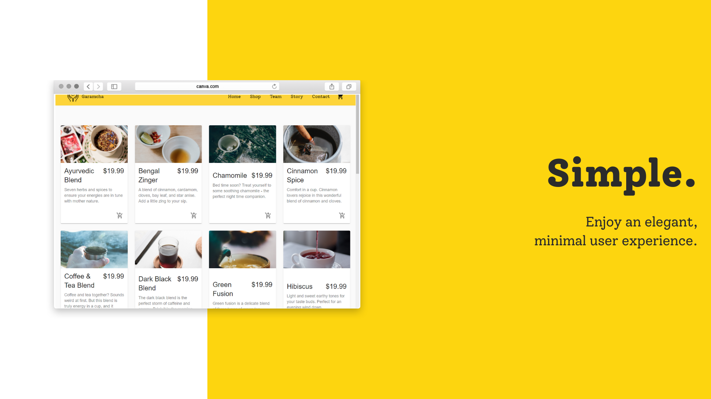
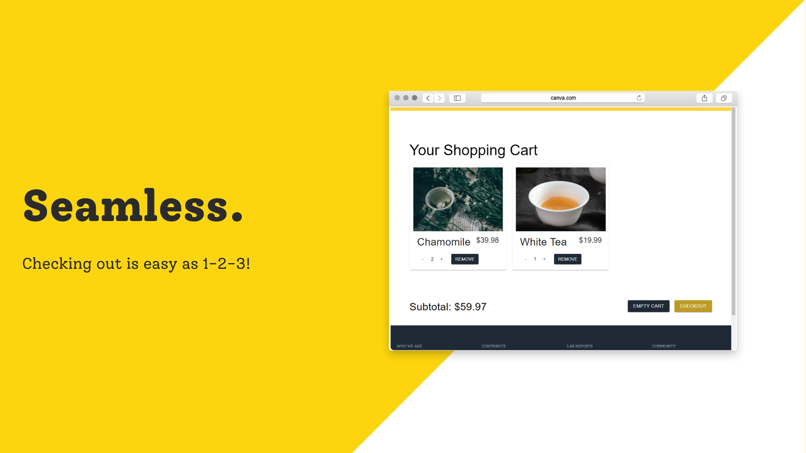
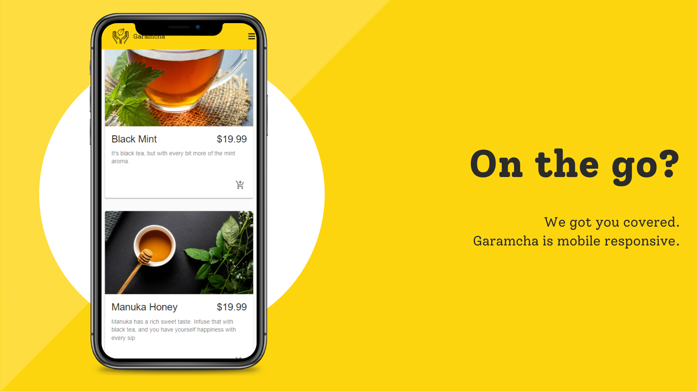

 

    

 

<em>“Don't underestimate the power of your vision to change the world. Whether that world is your office, your community, an industry or a global movement, you need to have a core belief that what you contribute can fundamentally change the paradigm or way of thinking about problems.”</em>

― Leroy Hood

## &nbsp;Overview

Using CommerceJS and Stripe API, we made an online market for a make-believe company called Garamcha (Pronounced: <em>'GAH'-ram-cha'</em>). The demonstration is of a tea company based in Bangladesh.

The purpose of this project is to shine a light on small businesses and ideas that benefit the world. <strong>Ideas are powerful</strong>. We want to show the world that any idea or business―no matter where it's from or who it's by―can be brought to life through creative web design.

 

    
    
    

 

## &nbsp;Story

**The idea of Garamcha:**  
The word garam in Bengali means *warm* or *hot*, and *cha* means tea. The inspiration for this word came about when we thought about how comforting it is to have a beverage fresh and ready upon coming home.

Bangladesh houses one of the three largest tea gardens in the world. Although the tea industry is booming in Bangladesh, [little of it is actually exported](https://www.tea.globaltradeconcern.com/). How can we add value to those industries? The answer to that is the idea of *Garamcha*, which is to host their business online for international trade. 

Our mock app starts in Bangladesh, because an idea that is so grassroots such as tea farmers in Bangladesh handcrafting tea and setting up an online market, can be applied to any business.

## &nbsp;Community

If you believe in our mission, feel free to star this project and contribute.

Inspiration:
- ["Bangladesh - Land of Stories"](https://www.youtube.com/watch?v=QNUSIOMb6vI)
- ["Bangladesh: Raw Beauty"](https://youtu.be/rDYdeq3JW_E)
- ["Bangladesh's Gorgeous Tea Fields"](https://www.youtube.com/watch?v=OSW-5Zd48s0)

## &nbsp; Installation

1. Register with Stripe and CommerceJS for API access
2. Clone this [repository](https://github.com/shafeeshafee/garamcha)
3. Create a .env with corresponding environmental variables
4. `npm i`
5. `npm start`

## &nbsp;Built With

| <button style="padding: 1em; font-size: 1em; outline: none; border: none; background: white;"></button> | <button style="padding: 1em; font-size: 1em; outline: none; border: none; background: white;"></button> | <button style="padding: 1em; font-size: 1em; outline: none; border: none; background: white;"></button> | <button style="padding: 1em; font-size: 1em; outline: none; border: none; background: white;"></button> | <button style="padding: 1em; font-size: 1em; outline: none; border: none; background: white;"></button> | <button style="padding: 1em; font-size: 1em; outline: none; border: none; background: white;"></button> | <button style="padding: 1em; font-size: 1em; outline: none; border: none; background: white;"></button> |
|------------------------------------------------------------------------------------------------------------------------------------------------------------------------------------------------------------------------------------------|-----------------------------------------------------------------------------------------------------------------------------------------------------------------------------------------------------------------------------------------------|-----------------------------------------------------------------------------------------------------------------------------------------------------------------------------------------------------------------------------------|--------------------------------------------------------------------------------------------------------------------------------------------------------------------------------------------------------------------------------------|------------------------------------------------------------------------------------------------------------------------------------------------------------------------------------------------------------------------------------------------------------------------------------------------------------------------------------------------------------------------------------------------------------------------------|----------------------------------------------------------------------------------------------------------------------------------------------------------------------------------------------------------------------------|---------------------------------------------------------------------------------------------------------------------------------------------------------------------------------------------------------------------------------------|

## &nbsp;Connect With Us

| Ayman Omer                                                                                                                                                                                                                                                                                                                             | Shafee Ahmed                                                                                                                                                                                                                                                                                                                 |
|----------------------------------------------------------------------------------------------------------------------------------------------------------------------------------------------------------------------------------------------------------------------------------------------------------------------------------------|------------------------------------------------------------------------------------------------------------------------------------------------------------------------------------------------------------------------------------------------------------------------------------------------------------------------------|
|   |   |
